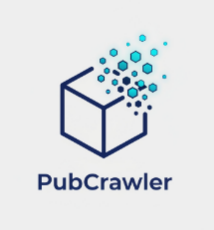

<div align="center">
  
  <h1>PubCrawler Pro</h1>
  <p>
    <strong>您的下一代 AI 学术趋势分析助手 🚀</strong>
  </p>
  <p>
    自动化爬取、分析并洞察顶级学术会议与 arXiv 的最新研究动态。
  </p>
  <p>
    
    
    
    
    
    
  </p>
</div>

---

## 🧐 项目简介 (Introduction)

您是否曾为追踪顶级学术会议（如 NeurIPS, ICLR, CVPR）和 arXiv 的最新动态而感到力不从心？是否想每天一睁眼，就有一份由 AI 精心总结好的、完全符合您研究兴趣的“学术头条”发送到邮箱？

**PubCrawler Pro** 正是为此而生。它不仅仅是一个论文爬虫，更是一个集**自动化数据采集**、**智能过滤**、**AI 辅助阅读**和**宏观趋势可视化**于一体的强大研究工作流引擎。我们的目标是——将您从繁琐的文献筛选中解放出来，专注于最前沿、最有价值的研究。✨

## 🌟 核心功能 (Core Features)

*   **📬 AI 每日简报 (Daily Briefing)**: (即将推出) 订阅您关心的 arXiv 主题（如 `cs.CV`）和关键词（如 `3D Vision`），每天自动将最新论文的 **AI 精炼总结**、**核心贡献**和**“值得读指数”**打包发送到您的邮箱。

*   **🧠 AI 深度对话 (AI-Powered Analysis)**: (即将推出) 在浏览任何一篇论文时，随时召唤 AI 助手。不仅能一键获得论文总结，更可以像与导师对话一样，**追问**关于论文的任何细节：“这篇文章的主要创新点是什么？”、“它与去年的 SOTA 方法有何不同？”、“它的局限性在哪里？”。

*   **⚙️ YAML 驱动**: 所有一次性爬取任务均在 `configs/tasks.yaml` 中定义，与代码完全分离，配置极其灵活。

*   **🌐 全方位多源爬取**: 内置支持 **OpenReview**, **CVF (CVPR/ICCV)**, **PMLR (ICML)**, **ACL Anthology** 等主流平台，并可通过 Selenium 应对动态加载的复杂网站。**arXiv 官方 API** 即将集成！

*   **🔍 智能过滤**: 可为每个任务设置关键词 `filters`，只抓取您关心的特定领域论文，实现精准打击。

*   **📊 自动化报告与词云**: 为每个爬取任务自动生成格式精美的 Markdown 报告，并嵌入直观的词云图，让年度研究热点一目了然。

*   **📈 趋势可视化**: (未来规划) 通过交互式仪表盘，洞察特定技术或研究领域在不同会议、不同年份的演进趋势。

*   **🕒 后台任务处理**: (即将推出) 集成 Celery 和 Redis，所有耗时任务都在后台异步执行，提供流畅的前端交互体验。

## 🚀 快速开始 (Getting Started)

### 1. 环境准备

*   Python 3.9+
*   Redis (用于 Celery 任务队列 - 第二阶段功能)

### 2. 安装步骤
1. 克隆项目
```bash
# 1. 克隆项目
git clone https://github.com/SingularGuyLeBorn/PubCrawler.git
cd PubCrawler
```

2. 创建并激活虚拟环境
```bash
python -m venv .venv
# Windows
.\.venv\Scripts\activate
# macOS / Linux
source .venv/bin/activate
```
3. 安装所有依赖
```bash
# 建议使用国内镜像源以加速
uv pip install -r requirements.txt -i https://pypi.tuna.tsinghua.edu.cn/simple
```

4. 【重要】下载 NLTK 数据包
```bash
# 首次运行时，需要手动下载停用词数据
python -m nltk.downloader stopwords
```

### 3. 配置

*   **任务配置**: 打开 `configs/tasks.yaml` 文件，根据您的需求修改 `source_definitions` 和 `tasks` 列表。您可以启用/禁用任务，设置 `limit` 和 `filters` 等。
*   **环境变量**: (针对未来AI功能) 创建一个 `.env` 文件，并填入您的 AI 模型 API 密钥：
    ```    OPENAI_API_KEY="sk-..."
    ```

### 4. 运行项目

*注意: API 服务为未来阶段规划。当前阶段仍使用命令行驱动。*

**当前阶段:**
```bash
python -m src.main
```

**未来阶段:**
```bash
# 启动 Celery Worker (在独立的终端中)
celery -A src.tasks worker --loglevel=info

# 启动 Celery Beat 调度器 (用于每日简报)
celery -A src.tasks beat --loglevel=info

# 启动 FastAPI/Flask Web 服务器 (在另一个终端中)
uvicorn src.app:app --reload
```

## 🛠️ 如何使用 (Usage)

当前阶段，项目由命令行驱动：

1.  **编辑 `configs/tasks.yaml`**: 这是您的指挥中心。在 `tasks` 列表下，找到您想运行的任务，将 `enabled` 设置为 `true`。您可以按需修改 `limit`, `download_pdfs` 和 `filters`。

2.  **运行主程序**:
    ```bash
    python -m src.main
    ```

3.  **查看成果**:
    所有产出文件都将保存在 `output/` 目录下，并以任务名自动创建子文件夹。

## 🗺️ 路线图 (Roadmap)

我们有一个清晰的多阶段计划，将 PubCrawler Pro 打造成顶级的学术分析平台：

*   **🧱 第一阶段: 奠定基石 - 脚本工具链完善 (当前)**
    *   [x] YAML 驱动的集中式任务配置
    *   [x] 多源爬虫框架 (Requests, Selenium)
    *   [x] 关键词过滤与数量限制
    *   [x] 自动化报告与词云分析
    *   [ ] **新增对 arXiv 的官方 API 支持**

*   **🚀 第二阶段: 服务化转型 - 从脚本到智能后台**
    *   [ ] **后端 API 化**: 使用 FastAPI/Flask 提供服务接口。
    *   [ ] **数据库集成**: 使用 SQLAlchemy + SQLite/PostgreSQL 持久化存储数据。
    *   [ ] **异步任务核心**: 集成 Celery + Redis 处理所有耗时操作。
    *   [ ] **“每日简报”调度器**: 集成 Celery Beat 实现定时任务，自动抓取 arXiv 并发送 AI 总结邮件。

*   **🎨 第三阶段: 极致交互 - 用户界面与体验**
    *   [ ] **现代化前端**: 使用 React/Vue 搭建现代、简洁的 Web 界面。
    *   [ ] **可视化任务配置**: 在网页上创建和管理“一次性爬取”与“每日简报”任务。
    *   [ ] **精美的结果展示**: 论文卡片式布局，清晰展示所有关键信息。
    *   [ ] **AI 对话侧边栏**: 在每篇论文旁集成交互式 AI 助手，实现深度问答。

*   **📊 第四阶段: 宏观洞察 - 数据可视化平台**
    *   [ ] **趋势分析仪表盘**: 创建交互式 Dashboard 页面。
    *   [ ] **高性能数据聚合 API**: 为前端提供复杂的趋势分析数据。
    *   [ ] **高级图表可视化**: 使用 ECharts/D3.js 渲染技术演进、会议主题分布等图表。

## 🙌 贡献 (Contributing)

欢迎任何形式的贡献！如果您有好的想法、发现了 Bug 或者想添加对新会议的支持，请随时提交 Pull Request 或创建 Issue。

## 📄 许可证 (License)

本项目采用 [MIT License](LICENSE) 授权。